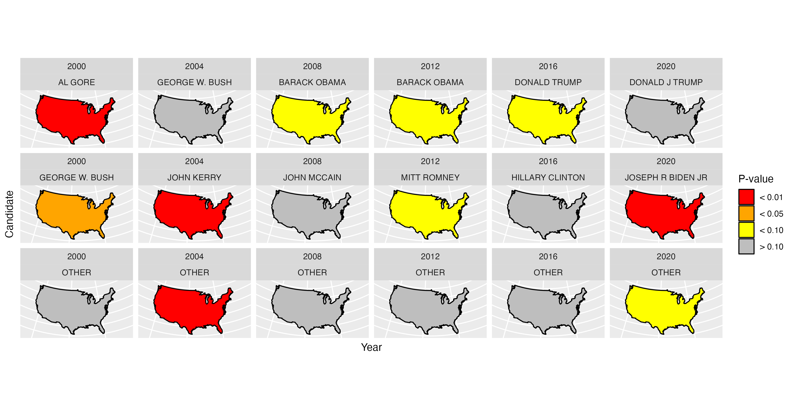
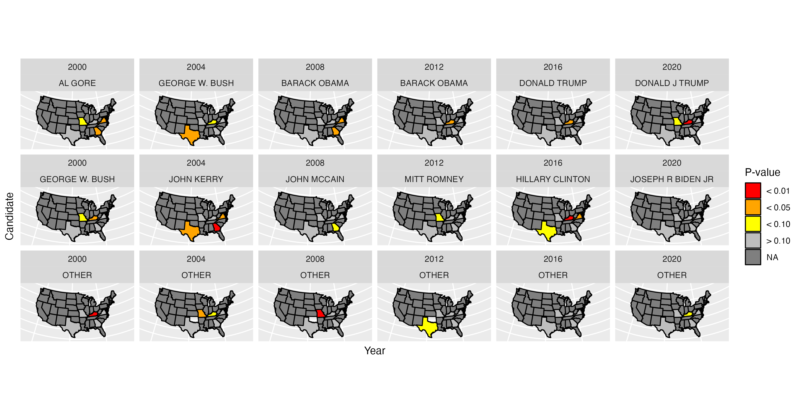
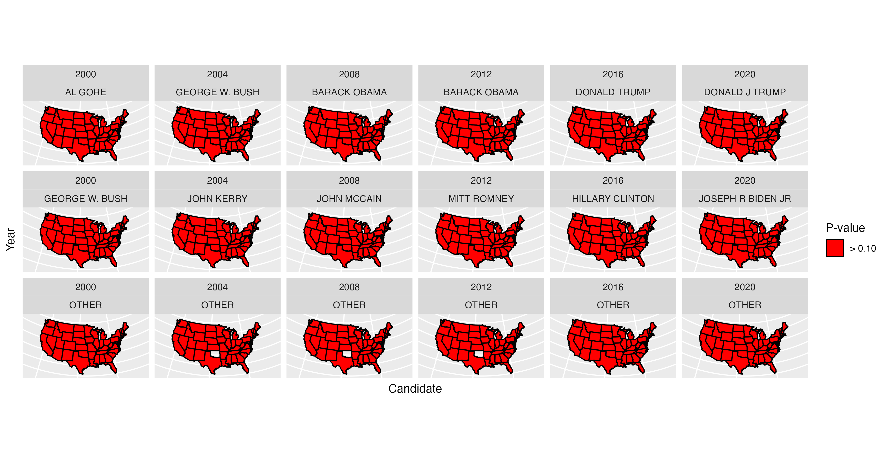

When the 2020 US Presidential election results started to come in, so did accusations of voter fraud. In several cases the accusations were quite unfounded, but a select few claimed to cite "statistical proof" of fraud. Many of the latter arguments referenced Benford's law.

[Benford's law](https://en.wikipedia.org/wiki/Benford's_law) describes the distribution of the leading digit of count data (e.g. the "1" in 100). It is based on the observation that in order to reach "2", one must first go through "1", and so on. Thus, higher digits are less frequently observed as the leading digit. 

So how does this relate to voter fraud? Well, some might argue that the distribution of leading digits in a candidate's votes across counties, states, etc., should follow Benford's law. In other words, the probability of observing a leading digit of `\(d\)` is given by:

`$$P(d) = \log \left(1 + \frac{1}{d} \right), \quad d = 1, \ldots, 9$$`
... and if the observed vote tallies overwhelmingly depart from this distribution, then the counts are not reliable.

Now, comparing vote totals to the distribution dictated by Benford's law cannot prove whether fraud exists or not for a variety of reasons. This [article](https://www.reuters.com/article/uk-factcheck-benford-idUSKBN27Q3AI) makes some good points about where this argument falls apart. Also, it is always possible to make a type I error (i.e. declare fraud exists when it actually does not) with any statistical analysis.

But that's no fun. So let's take a look at election results from my lifetime and conduct an analysis of our own. We will start by reading in a data set containing vote totals from all presidential elections since 2000. These data were obtained from the [MIT Election Data & Science Lab](https://dataverse.harvard.edu/dataset.xhtml?persistentId=doi:10.7910/DVN/VOQCHQ). 

We have available to us for each candidate their party affiliation (democrat, republican, and other), as well as the total number of votes they received in every county in the country. For this analysis, we will group all of the third-party/"other" candidates together.


```r
library(tidyverse)
votes <- read_csv('Data/Raw/countypres_2000-2020.csv') |>
  mutate(party = ifelse(party %in% c('REPUBLICAN','DEMOCRAT'), party, 'OTHER'),
         candidate = ifelse(party %in% c('REPUBLICAN','DEMOCRAT'), candidate, 'OTHER')) |>
  summarise(votes = sum(candidatevotes),
            .by = c(year, state, county_name, party, candidate))
```

```r
head(votes)
## # A tibble: 6 × 6
##    year state   county_name party      candidate      votes
##   <dbl> <chr>   <chr>       <chr>      <chr>          <dbl>
## 1  2000 ALABAMA AUTAUGA     DEMOCRAT   AL GORE         4942
## 2  2000 ALABAMA AUTAUGA     REPUBLICAN GEORGE W. BUSH 11993
## 3  2000 ALABAMA AUTAUGA     OTHER      OTHER            273
## 4  2000 ALABAMA BALDWIN     DEMOCRAT   AL GORE        13997
## 5  2000 ALABAMA BALDWIN     REPUBLICAN GEORGE W. BUSH 40872
## 6  2000 ALABAMA BALDWIN     OTHER      OTHER           1611
```

Now we will summarize the frequency of leading digits in county votes. At this point we can also summarize the frequencies of county-level leading digits for across the entire country to perform a country-level analysis.


```r
# Tabulate leading digits within state and overall ------------------------

# Within state
state_digits <- votes |>
  filter(votes > 0) |>
  mutate(digit = as.numeric(substr(votes, 1, 1))) |>
  group_by(year, state, party, candidate, digit) |>
  count() |>
  ungroup()

# Overall
country_digits <- state_digits |>
  group_by(year, party, candidate, digit) |>
  summarise(n = sum(n), .groups = 'drop')
```

We will also create a data frame containing the definition of Benford's law.


```r
benford <- data.frame(digit = 1:9) %>%
  mutate(exp = log(1 + 1 / digit, 10))
```

Let's begin by visualizing the actual frequencies for each party in every election:


```r
country_digits |>
  group_by(year, party, candidate) |>
  mutate(obs = n / sum(n)) |>
  ggplot(aes(x = digit)) +
  geom_line(aes(y = obs, group = candidate, color = party)) +
  geom_col(data = benford, aes(y = exp), alpha = 0.3) +
  scale_x_continuous(breaks = 1:9) +
  facet_wrap(~year) +
  theme_bw() +
  labs(x = 'Leading Digit in Total County Votes',
       y = "% County Share (Expected vs. Observed)",
       color = "Party")
```
<div class="figure" style="text-align: center">

<p class="caption"><span id="fig:distributions"></span>Figure 1: Distribution of Vote Totals</p>
</div>


In general, it would appear that the distribution of leading digits in nationwide county votes has closely followed Benford's law in all elections since 2000 for all parties. But we should still formally test this. A common approach to comparing whether a certain set of data following a mathematical law is a [Chi-squared goodness-of-fit test](http://www.stat.yale.edu/Courses/1997-98/101/chigf.htm). This test compares the expected counts of each group to the observed counts, and provides a single `\(\chi^2_{k-1}\)` test statistic. The `\(k-1\)` degrees of freedom comes from the fact that given the total count, once the counts for `\(k-1\)` of the `\(k\)` groups are known, the last count must be determined. Further, we can calculate a p-value. Let's go ahead and define a function that returns the `\(\chi^2\)` GOF test p-value if the approximate is adequate, and a null value otherwise.


```r
# Define function to return chi-square GOF p-value when approximation is good
get_chisq_p <- function(obs, exp_dist, min_expected_frequency = 5){
  
  test <- suppressWarnings(chisq.test(obs, p = exp_dist))
  
  if (all(test$expected >= min_expected_frequency)) p_value <- test$p.value
  else p_value <- NA
  
  return(p_value)
}
```

Now let's apply this test to every party-year category on the country level and map the result.

```r
# Country-level p-values
country_pvals <- state_digits |>
  expand(nesting(year, party, candidate, state), digit) |>
  left_join(state_digits, by = join_by(year, party, candidate, state, digit)) |>
  mutate(n = replace_na(n, 0)) |>
  summarise(n = sum(n),
            .by = c(year, party, candidate, digit)) |>
  nest(.by = c(year, party, candidate)) |>
  mutate(pval = map(data, \(df) get_chisq_p(obs = df$n, exp = benford$exp)),
         flag = case_when(pval < 0.01 ~ '< 0.01',
                          pval < 0.05 ~ '< 0.05',
                          pval < 0.10 ~ '< 0.10',
                          pval > 0.10 ~ '> 0.10'))

# Map the result
usa <- map_data("usa")
usa |>
  cross_join(country_pvals) |>
  filter(!is.na(year)) |>
  ggplot(aes(x = long, y = lat, group = group, fill = flag)) +
  geom_polygon(color = 'black') +
  coord_map(projection = 'albers', lat0 = 39, lat1 = 45) +
  scale_fill_manual(values = c('red','orange','yellow','gray')) +
  facet_wrap(year~candidate, nrow = 3, ncol = 6, dir = 'v') +
  labs(fill = 'P-value',
       x = 'Year',
       y = 'Candidate') +
  theme(axis.ticks = element_blank(),
        axis.text = element_blank())
```
<div class="figure" style="text-align: center">

<p class="caption">(\#fig:country_chisq)Nationwide Chi-Square Test Results</p>
</div>

We see here that several parties have shown some evidence of departures from Benford's law on the country level since 2000. This is somewhat surprising given what we saw in the first figure, but we do have quite a bit of data so it is possible that we are able to detect very small departures, so I wouldn't read too much into it.

Now let's do the same for individual states:


```r
# State-level p-values
state_pvals <- state_digits |>
  expand(nesting(year, party, candidate, state), digit) |>
  left_join(state_digits, by = join_by(year, party, candidate, state, digit)) |>
  mutate(n = replace_na(n, 0)) |>
  nest(.by = c(year, party, candidate, state)) |>
  mutate(pval = map(data, \(df) get_chisq_p(obs = df$n, exp = benford$exp)),
         flag = case_when(pval < 0.01 ~ '< 0.01',
                          pval < 0.05 ~ '< 0.05',
                          pval < 0.10 ~ '< 0.10',
                          pval > 0.10 ~ '> 0.10'))

# Map results
us_states <- map_data("state") |>
  mutate(state = toupper(str_to_title(region)))
us_states |>
  left_join(state_pvals, by = join_by(state), relationship = 'many-to-many') |>
  filter(!is.na(year)) |>
  ggplot(aes(x = long, y = lat, group = group, fill = flag)) +
  geom_polygon(color = 'black') +
  coord_map(projection = 'albers', lat0 = 39, lat1 = 45) +
  scale_fill_manual(values = c('red','orange','yellow','gray')) +
  facet_wrap(year~candidate, nrow = 3, ncol = 6, dir = 'v') +
  labs(fill = 'P-value',
       x = 'Year',
       y = 'Candidate') +
  theme(axis.ticks = element_blank(),
        axis.text = element_blank())
```
<div class="figure" style="text-align: center">

<p class="caption">(\#fig:state_chisq)State-level Chi-Square Test Results</p>
</div>

A few states show up as having majorly departed from Benford's law - in the most recent 2020 election both Kentucky and Missouri has somehat suspicious vote tallies. However we are conducting `\(3 \times 6 \times 50 = 900\)` statistical test here, so the probably of making a few Type I errors is quite high.

Unfortunately, we were not able to reliably assume a `\(\chi^2\)` distribution for the majority of states. I hid the warnings here, but R's `chisq.test()` function yelled at me quite a bit (825 warnings!). This is probably due to the fact that we had quite a few low-count cells. This was not an issue for the nationwide analysis given the sample size, but the average US state has only 62 counties, and so some digits may not be well-represented.

Fear not! There are other methods for testing this hypothesis. A popular one is a [permutation test](https://en.wikipedia.org/wiki/Permutation_test). This test essentially consists of computing a test statistic (we will stick with the same one for now) for many permutations of the observed data. We can then calculate the proportion of permuted test statistics that exceeded our observed one. Here is a function that will allow us to do this:

```r
# Define a permutation-based test
get_perm_p <- function(obs, exp_dist, npermute = 10000){

  exp <- exp_dist * sum(obs)
  
  # Observed test statistic (e.g., chi-squared statistic)
  obs_stat <- sum((obs - exp)^2 / exp)
  
  # Perform the permutation test
  p_stats <- replicate(npermute, {
    p_obs <- sample(obs)  # Permute the counts
    p_exp <- exp_dist * sum(p_obs) # Calculate the test statistic
    p_stat <- sum((p_obs - p_exp)^2 / p_exp)  
    p_stat
  })
  
  # Calculate p-value
  p_value <- mean(p_stats >= obs_stat)

  return(p_value)    
}
```

Now let's compute these p-values and take a look at the permutation-based state map:


```r
# State-level p-values (permutation-based)
p_state_pvals <- state_digits |>
  expand(nesting(year, party, candidate, state), digit) |>
  left_join(state_digits, by = join_by(year, party, candidate, state, digit)) |>
  mutate(n = replace_na(n, 0)) |>
  nest(.by = c(year, party, candidate, state)) |>
  mutate(pval = map(data, \(df) get_perm_p(obs = df$n, exp = benford$exp)),
         flag = case_when(pval < 0.01 ~ '< 0.01',
                          pval < 0.05 ~ '< 0.05',
                          pval < 0.10 ~ '< 0.10',
                          pval > 0.10 ~ '> 0.10'))

# Map results
us_states |>
  left_join(p_state_pvals, by = join_by(state), relationship = 'many-to-many') |>
  filter(!is.na(year)) |>
  ggplot(aes(x = long, y = lat, group = group, fill = flag)) +
  geom_polygon(color = 'black') +
  coord_map(projection = 'albers', lat0 = 39, lat1 = 45) +
  scale_fill_manual(values = c('red','orange','yellow','gray')) +
  facet_wrap(year~candidate, nrow = 3, ncol = 6, dir = 'v') +
  labs(fill = 'P-value',
       x = 'Candidate',
       y = 'Year') +
  theme(axis.ticks = element_blank(),
        axis.text = element_blank())
```
<div class="figure" style="text-align: center">

<p class="caption">(\#fig:state_perm)State-level Permutation Test Results</p>
</div>

This map is not nearly exciting - we don't have much evidence for any state ever having departed from Benford's law. It would be a good idea to compare the permutation test's ability to detect a departure to the `\(\chi^2\)` test (when assumptions are satisfied), but it will have to do for now. In a vast majority of cases the assumption were not satsified, so this analysis is more reliable (but maybe less powerful).
