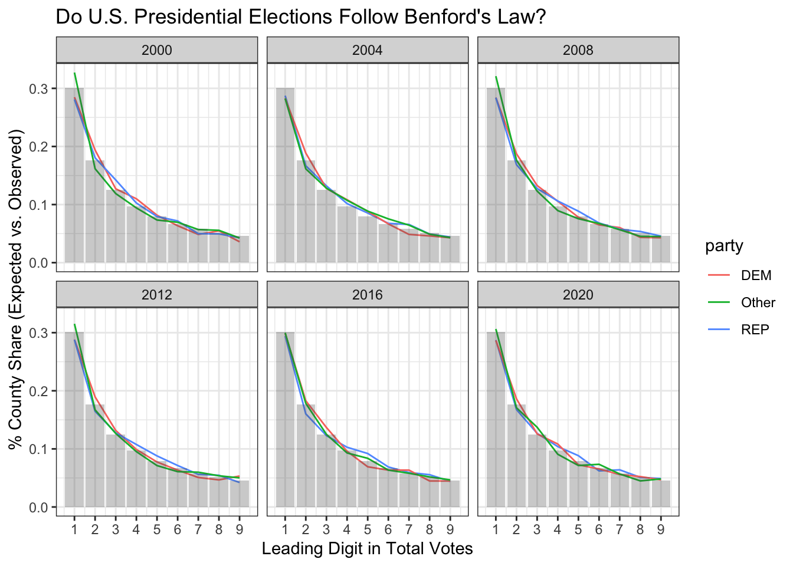
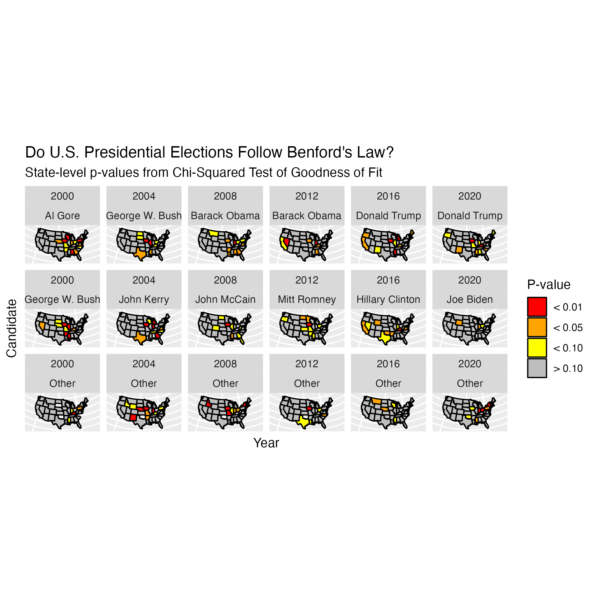
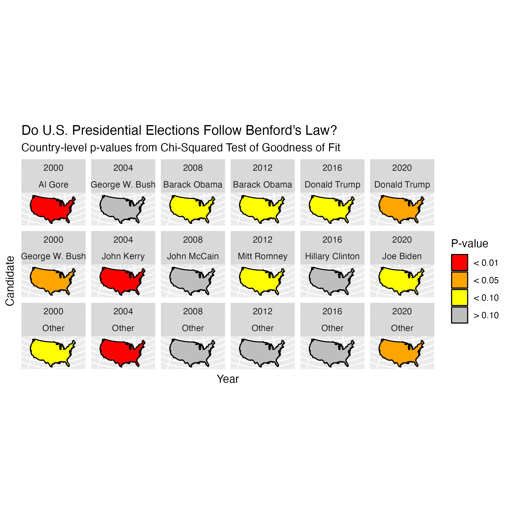

When the 2020 US Presidential election results started to come in, so did accusations of voter fraud. In several cases the accusations were quite unfounded, but a select few cited "statistical proof" of fraud. Many of the latter arguments referenced Benford's law.

[Benford's law](https://en.wikipedia.org/wiki/Benford's_law) describes the distribution of the leading digit of count data (e.g. the "1" in 100). It is based on the observation that in order to reach "2", one must first go through "1", and so on. Thus, higher digits are less frequently observed as the leading digit. 

So how does this relate to voter fraud? Well, some might argue that the distribution of leading digits in a candidate's votes across counties, states, etc., should follow Benford's law. In other words, the probability of observing a leading digit of `\(d\)` is given by:

`$$P(d) = \log \left(1 + \frac{1}{d} \right), \quad d = 1, \ldots, 9$$`
... and if the observed vote tallies overwhelmingly depart from this distribution, then the counts are not reliable.

Now, comparing vote totals to the distribution dictated by Benford's law cannot prove whether fraud exists or not for a variety of reasons. This [article](https://www.reuters.com/article/uk-factcheck-benford-idUSKBN27Q3AI) makes some good points about where this argument falls apart. Also, it is always possible to make a type I error (i.e. declare fraud exists when it actually does not) with any statistical analysis.

But that's no fun. So let's take a look at election results from my lifetime and conduct an analysis of our own.


We will start by reading in a data set containing vote totals from all presidential elections since 2000. We have available to us for each candidate their party affiliation (democrat, republican, and other), as well as the total number of votes they received in every county in the country.

```r
library(tidyverse)
votes <- read_csv('Data/votes.csv')
head(votes)
## # A tibble: 6 × 6
##    year state   county  candidate      party votes
##   <dbl> <chr>   <chr>   <chr>          <chr> <dbl>
## 1  2000 Alabama Autauga Al Gore        DEM    4942
## 2  2000 Alabama Autauga George W. Bush REP   11993
## 3  2000 Alabama Autauga Other          Other   273
## 4  2000 Alabama Baldwin Al Gore        DEM   13997
## 5  2000 Alabama Baldwin George W. Bush REP   40872
## 6  2000 Alabama Baldwin Other          Other  1611
```

Now we will summarize the frequency of leading digits in county votes, ignoring cases where no votes are available for the candidate. At this point we can also summarize the frequencies of county-level leading digits for across the entire country to perform a country-level analysis.


```r
# Tally number of counties with each digit within state
state_digits <- votes %>%
  filter(votes > 0 & !is.na(votes)) %>%
  mutate(digit = as.numeric(substr(votes,1,1))) %>%
  summarise(n = n(), 
            .by = c(year, state, candidate, party, digit)) %>%
  filter(digit %in% 1:9)

# Tally number of counties with each digit in the entire country
country_digits <- state_digits %>%
  summarise(n = sum(n),
            .by = c(year, candidate, party, digit))
```

At this point it will also be helpful to store the expected frequences according to Benford's law.


```r
benford <- data.frame(digit = 1:9) %>%
  mutate(exp = log(1 + 1 / digit, 10))
```

Let's begin by visualizing the actual frequencies for each party in every election:


```r
country_digits %>%
  mutate(obs = n / sum(n),
         .by = c(year, candidate, party)) %>%
  ggplot(aes(x = digit)) +
  geom_line(aes(y = obs, group = candidate, color = party)) +
  geom_col(data = benford, aes(y = exp), alpha = 0.3) +
  scale_x_continuous(breaks = 1:9) +
  facet_wrap(~year) +
  theme_bw() +
  labs(x = 'Leading Digit in Total Votes',
       y = "% County Share (Expected vs. Observed)")
```
<div class="figure" style="text-align: center">

<p class="caption"><span id="fig:benford"></span>Figure 1: Distribution of Vote Totals</p>
</div>


In general, it would appear that the distribution of leading digits in nationwide county votes has closely followed Benford's law in all elections since 2020 for all parties. But we should still formally test this. A common approach to comparing two distributions is a chi-squared goodness-of-fit test. This test compares the expected counts of each group to the observed counts, and provides a single `\(\chi^2_{k-1}\)` test statistic. The `\(k-1\)` degrees of freedom comes from the fact that given the total count, once the counts for `\(k-1\)` of the `\(k\)` groups are known, the last count must be determined. Further, we can calculate a p-value. Here I do this for all party-year-state combinations.


```r
# State-level p-values
state_pvals <- state_digits %>%
  expand(nesting(year, candidate, state), digit) %>%
  left_join(state_digits, by = join_by(year, candidate, state, digit)) %>%
  mutate(n = replace_na(n, 0)) %>%
  nest(.by = c(year, candidate, state)) %>%
  mutate(pval = purrr::map(data, \(df) chisq.test(x = df$n, p = benford$exp)$p.value),
         flag = case_when(pval < 0.01 ~ '< 0.01',
                          pval < 0.05 ~ '< 0.05',
                          pval < 0.10 ~ '< 0.10',
                          pval > 0.10 ~ '> 0.10'))
## Warning: There were 807 warnings in `mutate()`.
## The first warning was:
## ℹ In argument: `pval = purrr::map(data, function(df) chisq.test(x = df$n, p =
##   benford$exp)$p.value)`.
## Caused by warning in `chisq.test()`:
## ! Chi-squared approximation may be incorrect
## ℹ Run `dplyr::last_dplyr_warnings()` to see the 806 remaining warnings.
```

The warnings we receive here are because certain digits have very low counts. For chi-squared test, it is often recommended that each group have at least 5 observations to it, otherwise the test statistic may not be reliable. One alternative one might try is a Fisher's exact test, though that would be computationally very difficult for this setting. Another idea is to derive some test statistic based on a multinomial distribution. But for now, we will stick to the chi-squared test and take the results with a grain of salt.

We can also calculate p-values on the country scale. Let's do that now.


```r
# Country-level p-values
country_pvals <- state_digits %>%
  expand(nesting(year, candidate, state), digit) %>%
  left_join(state_digits, by = join_by(year, candidate, state, digit)) %>%
  mutate(n = replace_na(n, 0)) %>%
  summarise(n = sum(n),
            .by = c(year, candidate, digit)) %>%
  nest(.by = c(year, candidate)) %>%
  mutate(pval = purrr::map(data, function(df) chisq.test(x = df$n, p = benford$exp)$p.value),
         flag = case_when(pval < 0.01 ~ '< 0.01',
                          pval < 0.05 ~ '< 0.05',
                          pval < 0.10 ~ '< 0.10',
                          pval > 0.10 ~ '> 0.10'))
```

Great! Now we have our p-values. Let's check out some maps to see where and when each candidates has(n't) experienced vote tallies that deviate from Benford's law. 


```r
# Get US state map data
us_states <- map_data("state") %>%
  mutate(state = str_to_title(region))

# State Map
us_states %>%
  left_join(state_pvals, by = join_by(state), relationship = 'many-to-many') %>%
  filter(!is.na(year)) %>%
  ggplot(aes(x = long, y = lat, group = group, fill = flag)) +
  geom_polygon(color = 'black') +
  coord_map(projection = 'albers', lat0 = 39, lat1 = 45) +
  scale_fill_manual(values = c('red','orange','yellow','gray')) +
  facet_wrap(year~candidate, nrow = 6, ncol = 3, dir = 'h') +
  labs(fill = 'P-value',
       x = 'Candidate',
       y = 'Year') +
  theme(axis.ticks = element_blank(),
        axis.text = element_blank())
```
<div class="figure" style="text-align: center">

<p class="caption"><span id="fig:unnamed-chunk-9"></span>Figure 2: State Map</p>
</div>

On the state-level, we see that the majority of states have little evidence of departure from Benford's law. On state in particular that stands out is Iowa, which was flagged with some degree of evidence in 14 out of 18 maps! It is also worth pointing out that all candidates had at least one state with questionable vote distributions.


```r
us <- map_data("usa")

# US Map
us %>%
  cross_join(country_pvals) %>%
  filter(!is.na(year)) %>%
  ggplot(aes(x = long, y = lat, group = group, fill = flag)) +
  geom_polygon(color = 'black') +
  coord_map(projection = 'albers', lat0 = 39, lat1 = 45) +
  scale_fill_manual(values = c('red','orange','yellow','gray')) +
  facet_wrap(year~candidate, nrow = 6, ncol = 3, dir = 'h') +
  labs(fill = 'P-value',
       x = 'Candidate',
       y = 'Year') +
  theme(axis.ticks = element_blank(),
        axis.text = element_blank())
```

<div class="figure" style="text-align: center">

<p class="caption"><span id="fig:unnamed-chunk-11"></span>Figure 3: Country Map</p>
</div>

On a nationwide scale, the most suspicious vote tallies occurred for republican Al Gore in 2000, democrat John Kerry in 2004, and the other parties in 2004. In both 2000 and 2020, vote tallies for all candidates had some level of suspicion.
