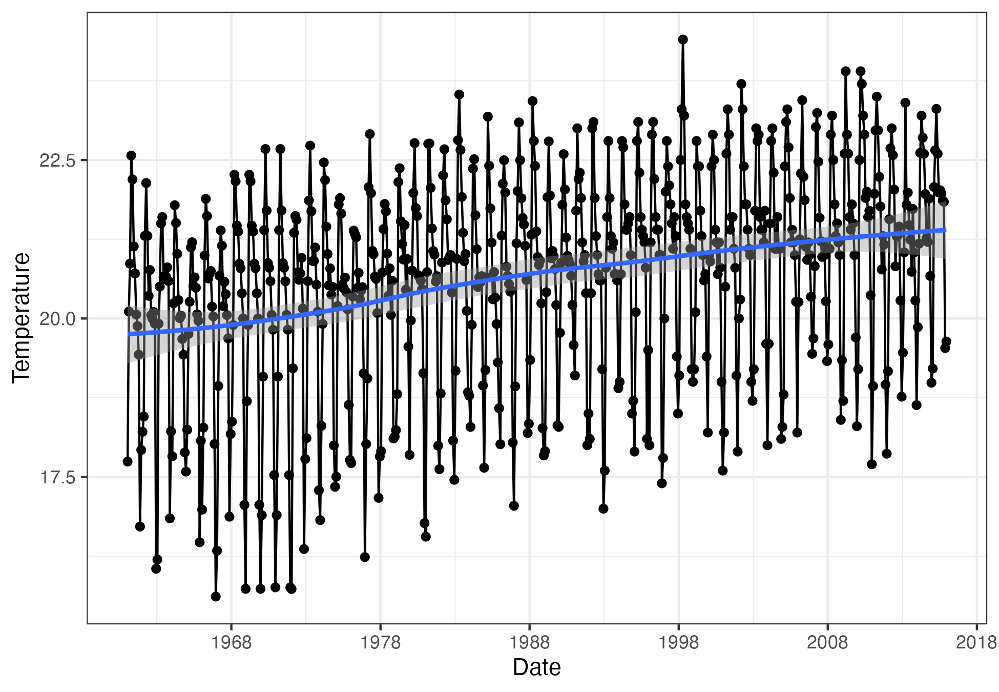
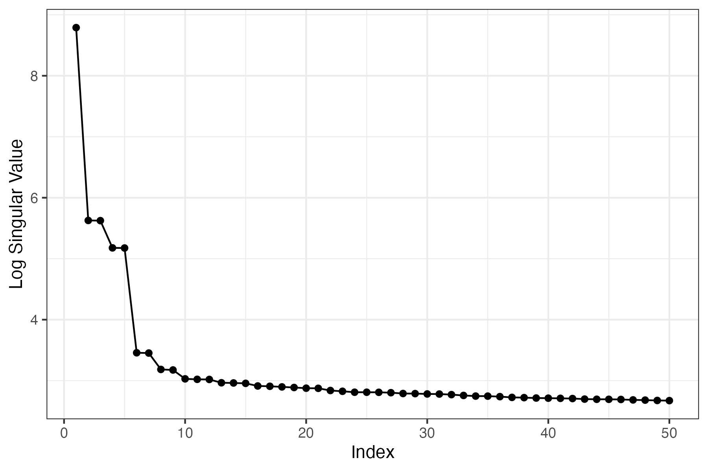
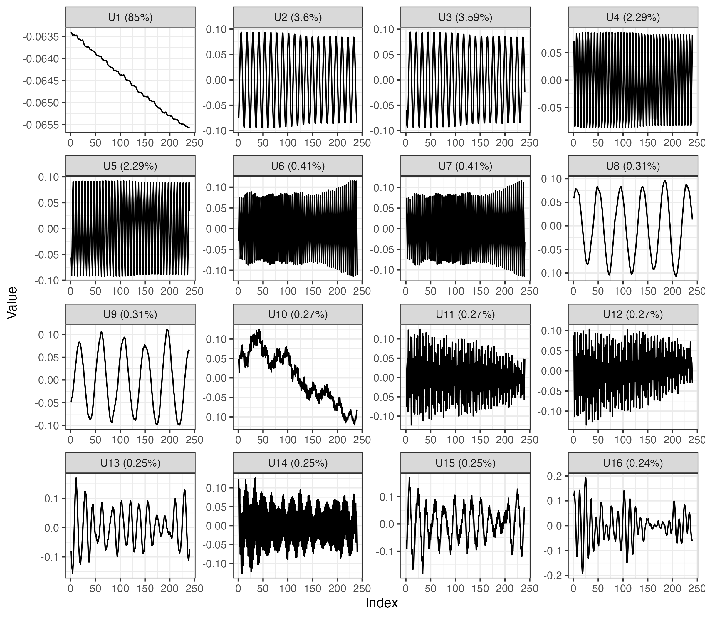
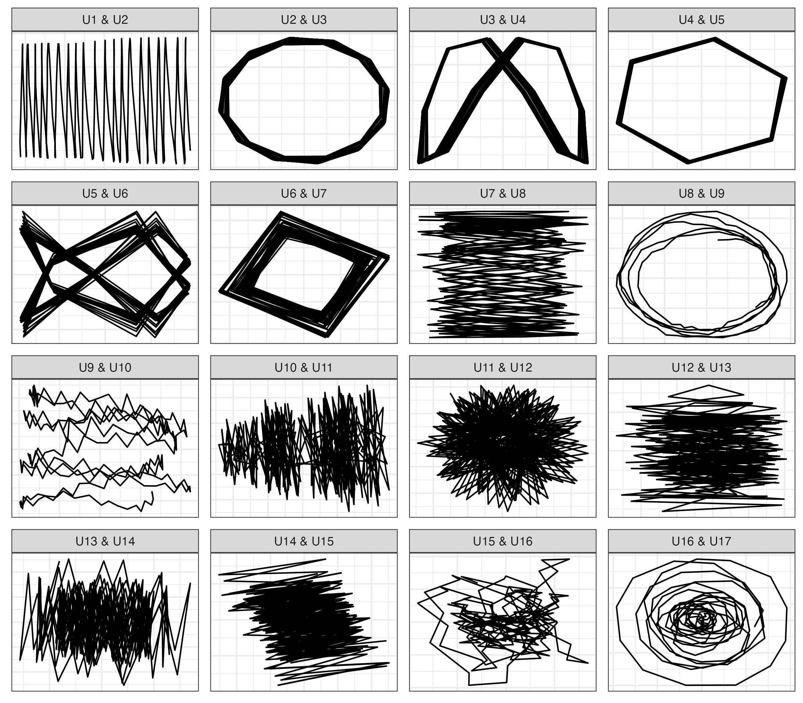
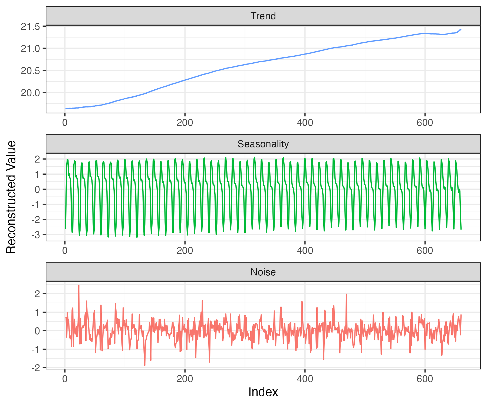
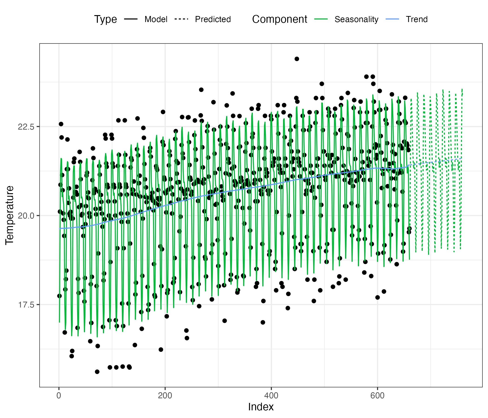

```{r setup, include=FALSE}
knitr::opts_chunk$set(collapse = TRUE)
```

Singular spectrum analysis (SSA) is a powerful tool for analyzing time-series data. It leverages the [singular value decomposition](https://en.wikipedia.org/wiki/Singular_value_decomposition) (SVD) to "separate" individual components of the time series that can be difficult to visualize with the human eye. In this post I will illustrate how to apply basic SSA to a one-dimensional time series composed of average monthly minimum temperature between January 1961 and December 2015 for the city of Sokodé, Togo. We plot the time series below:

```{r, echo = FALSE, message = FALSE, eval = FALSE}
library(tidyverse)
sokode_min <- read_csv('Data/sokode_min.csv')
sokode_min |>
  ggplot(aes(x = Date, y = Temperature)) +
  geom_point() +
  geom_line() +
  geom_smooth() +
  scale_x_date(date_breaks = '10 years', date_labels = "%Y") +
  theme_bw() +
  labs()
```

```{r, eval = TRUE, echo = FALSE, out.width="90%", fig.cap='Sokode Minimum Temperatures', fig.align='center'}

```

There is a clear increasing trend in the average monthly minimum temperatures for Sokodé. However, there are a great amount of fluctuations within each year. These fluctuations are referred to as *seasonality*, or sometimes *cycles* when the period is longer than a year. We will use SSA to help separate the trend from seasonality and to uncover the different types of seasonality that are present.

There are 4 main steps when performing SSA:
  - Embedding
  - Decomposition (using SVD)
  - Eigentriple grouping
  - Reconstruction

## Embedding
Embedding describes the process of setting up the *trajectory matrix*. We do this be selecting a window size $L$. The main guidelines around the selection of $L$ are that 1) $L$ must be restricted to $\left(1, \frac{N}{2} \right)$, where $N$ is the length of the time series, and 2) $L$ should be divisible by the length of any seasonal trend you hope to find in the data. 

Once we have selected $L$, we can create an $L \times K$ trajectory matrix that looks like this:

$$
A = [A_1:\ldots:A_k]= (a_{ij})_{i,j=1}^{L,K} =
\begin{bmatrix}
a_1 & a_2 & a_3 & \cdots & a_K \\
a_2 & a_3 & a_4 & \cdots & a_{K+1} \\
a_3 & a_4 & a_5 & \cdots & a_{K+2} \\
\vdots & \vdots & \vdots & \ddots & \vdots \\
a_L & a_{L+1} & a_{L+2} & \cdots & a_N
\end{bmatrix}
$$


In R this is fairly simple to do with the `sapply()` function:
```{r, eval = FALSE}
temp <- sokode_min$Temperature
N <- length(temp)
L <- 240
K <- N - L + 1       
d <- 1:L

# Create the trajectory matrix
a <- sapply(1:K, \(i) temp[i:(i + L - 1)])
A <- matrix(a, nrow = L, ncol = K)
```


## Decomposition
The next step is to apply SVD to the trajectory matrix. In other words, we wish to decompose $\mathbf{A}$ into a product of matrices such that
$$\mathbf{A} = \mathbf{U D V}^T$$
Both $\mathbf{U}$ and $\mathbf{D}$ are square $L \times L$ matrices, and $\mathbf{V}$ is a $K \times L$ matrix. $\mathbf{D}$ is a diagonal matrix whose non-zero elements are known as *singular values*. The columns of $\mathbf{U}$ are known as the *left singular vectors*. Typically, the decomposition is written such that the singular values are in decreasing order.

In R we can use the `svd()` function:

```{r, eval = FALSE}
A_decomposed <- svd(A)
U <- A_decomposed$u
V <- A_decomposed$v
D <- diag(A_decomposed$d)
```

One helpful thing to do after the decomposition is to view a [scree plot](https://en.wikipedia.org/wiki/Scree_plot) of the singular values.
```{r, eval = FALSE}
# Plot the singular values
scree_plot(D, trend = TRUE) # with trend
```
```{r, eval = TRUE, echo = FALSE, out.width="90%", fig.cap='Scree Plot', fig.align='center'}

```
Here we see that the first singular value is much larger than the rest. This value typically corresponds to the overarching long-term trend (when one is present). After that, the singular values tend to come in pairs. These pairs can be thought of a matched pair of sine and cosine oscillations, which together make up one component of the seasonality. More on this later.

Further, $\mathbf{A}$ can now be expressed as a sum of rank deficient matrices.
$$\mathbf{A} = \mathbf{A}_1 + \mathbf{A}_2 + \ldots + \mathbf{A}_L$$

We will store these matrices in a list called `X`.
```{r, eval = FALSE}
# Obtain the individual components of the SVD (no grouping)
X <- list()
for(i in d){
  X[[i]] <- D[i,i] * U[,i,drop = FALSE] %*% t(V)[i,,drop=FALSE]
}
```

Here $\mathbf{X}_i = \lambda_i \mathbf{U}_i \mathbf{V}_i^T$. The set of $(\lambda_i, \mathbf{U}_i, \mathbf{V}_i)$ is referred to as an *eigentriple*, where $\lambda_i$ is the singular value and $\mathbf{U}_i$ and $\mathbf{V}_i$ are the left and right singular vectors, respectively.

## Eigentriple Grouping
At this point we have a collection of $L$ eigentriples. However, different eigentriples represent different components of the time series. Eigentriple grouping is all about identifying which sets of eigentriples go together. To simplify things, we will consider only 3 groups: trend, seasonality, and noise, but in practice one might make even more groups. Let $\mathcal{T}$ be the subset of eigentriples which correspond to trend, $\mathcal{S}$ the subset which correspond to seasonality, and $\mathcal{R}$ the subset which correspond to noise, or residual variation. Note the decomposition of $\mathbf{A}$ can be written as:

$$\mathbf{A} = \mathbf{A}_\mathcal{T} + \mathbf{A}_\mathcal{S} + \mathbf{A}_\mathcal{R}$$
where $\mathbf{A}_\mathcal{T} = \sum_{i \in \mathcal{T}} \mathbf{A}_i$, $\mathbf{A}_\mathcal{S} = \sum_{i \in \mathcal{S}} \mathbf{A}_i$, and $\mathbf{A}_\mathcal{R} = \sum_{i \in \mathcal{R}} \mathbf{A}_i$. 

This notation is only particularly meaningful if the $\mathcal{T}$, $\mathcal{S}$, and $\mathcal{R}$ are meaningfully selected. We have several tools available at our disposal for assigning eigentriples to groups, but my personal favorites are plots of the left singular vectors.

```{r, eval = FALSE}
plot_left_singular_vectors(U, D, n_vectors = 16, trend = TRUE) # with trend
```
```{r vectors, eval = TRUE, echo = FALSE, out.width="90%", fig.cap='Left Singular Vectors', fig.align='center'}

```

Typically, the long-term trend will have the greatest influence on the time series, and thus will be the first singular vector. Once we move past this, however, we begin to see "wavy" series. These correspond to seasonal effects, and typically come in pairs. The percentages displayed are calculated as $\frac{\lambda_i}{\sum_{i=1}^L\lambda_i}$, and give a rough estimate of the importance of each vector. 

Left singular values that have long-term patterns might be attributed to trend, while vectors with many oscillations belong in seasonality. However it can sometimes be difficult to tell where noise starts. Another useful diagnostic tool is plotting consecutive pairs of left singular vectors. We only plot consecutive pairs because matching seasonal components often have very similar singular values and are positioned next to each other.

```{r, eval = FALSE}
plot_left_singular_vectors(U, n_vectors = 12, type = 'paired') # without trend
```
```{r pairs, eval = TRUE, echo = FALSE, out.width="90%", fig.cap='Paired Left Singular Vectors', fig.align='center'}

```

In these plots, we look for n-vertex polygons. When two seasonal components "line up" they form such a shape, where the number of vertices of the polygon corresponds to the period of the sinusoidal oscillation. For more information on why this happens, check out [this](https://perso.ens-lyon.fr/patrick.flandrin/hassani.pdf) great resource on SSA.

These plots help with delineating between seasonality and noise because the n-vertex polygons will not be as clear in noisy patterns. Here we clearly have a 12 month period defined by the second and third singular vectors, a 6 month period defined by the fourth and fifth, and a 4 month period defined by the sixth and seventh. The 8th and ninth vectors might combine to form a long-term cycle, while the eleventh and twelfth might form a very short-term season.

At some point, these components are not adding much signal and can probably be lumped in with noise. Going back to the scree plot, it might make since to cut things off after the ninth eigentriple. But the tenth vector looks as though it may include some additional long-term trend, and it might be interesting to see what happens when we include the eleventh and twelfth vectors into the seasonality component, so we will try that.


## Reconstruction

To recap the previous section, we have decided on the following groups of the eigentriples: $\mathcal{T} = \left\{ 1, 10 \right\}$, $\mathcal{S} = \left\{ 2, 3, 4, 5, 6, 7, 8, 9, 11, 12 \right\}$, and $\mathcal{R} = \left\{i : i \notin \mathcal{T} \cup \mathcal{S} \right\}$.

```{r eval = FALSE}
# Split eigentriples according to grouping analysis
trend_id <- c(1, 10) #c(1,8)
season_id <-  c(2:9, 11:12) # c(2:3, 4:5, 6:6, 9:10)
noise_id <- d[!(d %in% c(trend_id, season_id))]

# Create vector indicating which group each component belongs to
groups <- numeric(L)
groups[trend_id] <- 1; groups[season_id] <- 2; groups[noise_id] <- 3
```

For the reconstruction step, we apply diagonal averaging within each of $\mathbf{A}_\mathcal{T}$, $\mathbf{A}_\mathcal{S}$, and $\mathbf{A}_\mathcal{R}$ to return a reconstructed one-dimensional time-series for each group. Simply put, we average the components of the matrix across $\left\{i, j :i+j=C-1 \right\}$ for some constant $C$. After this, we are left with three time-series $Y_N^{(k)}, k \in \left\{\mathcal{T}, \mathcal{S}, \mathcal{R} \right\}$.

```{r, eval = FALSE}
# Diagonal average Hankel 
hankelize <- function(X){
  n_rows <- nrow(X)
  n_cols <- ncol(X)
  N <- n_rows + n_cols - 1
  y_sum <- numeric(N)
  y_n <- numeric(N)
  
  for(i in 1:n_rows){
    for(j in 1:n_cols){
      y_sum[i + j - 1] <- y_sum[i + j - 1] + X[i,j]
      y_n[i + j - 1] <- y_n[i + j - 1] + 1
    }
  }
  
  return(y_sum / y_n)
}

# Perform the reconstruction with diagonal averaging
Y_k <- lapply(unique(groups), \(j) hankelize(Reduce('+', X[groups == j])))

data.frame(Index = 1:N,
           Value = do.call(c, Y_k),
           Type = rep(c('Trend','Seasonality','Noise'), each = N)) |>
  ggplot(aes(x = Index, y = Value, color = Type)) +
  geom_line(show.legend = FALSE) +
  theme_bw() +
  facet_wrap(~factor(Type, levels = c('Trend','Seasonality','Noise')),
             scales = 'free', ncol = 1) +
  labs(y = 'Reconstructed Value')
```
```{r reconstruction, eval = TRUE, echo = FALSE, out.width="90%", fig.cap='Reconstructed Components', fig.align = 'center'}

```

Post reconstruction, we see that there is a relatively linear increasing trend in time. There are several seasonal oscillations represented in the seasonality component, adn the "noise" appears quite random. We have completed SSA!


## Prediction

As the late and great Billy Mays once said, "but wait, there's more!"

So far we have seen how powerful SSA is when it comes to decomposing time-series data. But wouldn't it be great if we could use this to forecast into the future? The good news is we can. There are many ways to make forecasts using SSA, but a simple method is using a [linear recurrent relation](https://en.wikipedia.org/wiki/Linear_recurrence_with_constant_coefficients). An order $d$ linear recurrence relation has the following form:

$$Y_{i+d} = \sum_{r=1}^{d} a_r Y_{i+d-r}, \quad 1 \le i \le N-d$$
Let $\pi_i$ be the $L^{th}$ component of $\mathbf{U}_i$, $\nu^2 = \sum_{i=1}^L \pi_i^2$, and $\tilde{\mathbf{U}}_i$ represent $\mathbf{U}_i$ without it's $L^{th}$ component. Solving for the $\mathbf{a}$ parameters we get:
$$\mathbf{a} = \frac{1}{1-\nu^2}\sum_{r=1}^d \pi_i\tilde{\mathbf{U}}_i$$

In the following code snippet, we set $d = L$ and make predictions for 100 months into the future:
```{r, eval = FALSE}
# LRR

len <- 100
preds <- list()
for(i in unique(groups)){
  
  # Compute LRR parameters
  idx <- L
  lpf <- U[, groups == i, drop = FALSE] %*% t(U[idx, groups == i, drop = FALSE])
  params <- lpf[-idx] / (1 - lpf[idx])
  
  preds[[i]] <- c(Y_k[[i]], rep(NA, len))
  for(j in 1:len){
    preds[[i]][N + j] <- sum(preds[[i]][(N+j-(L-1)):(N+j-1)] * params)
  }
  
  preds[[i]] <- preds[[i]][(N+1):(N+len)]
  
}

data.frame(Index = 1:(N+100),
           obs = c(temp, rep(NA, 100)),
           Trend = c(Y_k[[1]], preds[[1]])) |>
  mutate(Seasonality = Trend + c(Y_k[[2]], preds[[2]])) |>
  pivot_longer(cols = Trend:Seasonality, names_to = 'Component', values_to = 'Value') |>
  mutate(Type = ifelse(Index > N, 'Predicted', 'Model')) |>
  ggplot(aes(x = Index)) +
  geom_point(aes(y = obs)) +
  geom_line(aes(y = Value, color = Component, lty = Type)) +
  scale_color_manual(values = scales::hue_pal()(3)[2:3]) +
  theme_bw() +
  theme(legend.position = 'top') +
  labs(x = 'Index', 
       y = 'Temperature',
       color = 'Component',
       lty = 'Type')
```
```{r prediction, eval = TRUE, echo = FALSE, out.width="90%", fig.cap='Recurrent Forecasts', fig.align='center'}

```

It would appear that our predictions are quite reasonable! Linear recurrence relations certainly aren't the end-all be-all, but they do provide a quick and dirty way to obtain useful forecasts following the reconstruction step in SSA.

I hope this short introduction to singular spectrum analysis was helpful to you! Here are some more resources to keep you going:
- [Singular Spectrum Analysis: Methodology and Comparison](https://perso.ens-lyon.fr/patrick.flandrin/hassani.pdf)
- [Singular Spectrum Analysis with R](https://ssa-with-r-book.github.io)
- [Rssa: A Collection of Methods for Singular Spectrum Analysis](https://cran.r-project.org/web/packages/Rssa/index.html)


# Plotting Functions
If you are interested in the functions used to create the scree and left singular value plots, look no more.
```{r, eval = FALSE}
scree_plot <- function(D, n = min(50, nrow(D)), trend = FALSE){
  
  d <- diag(D)
  
  if(!trend) d <- d[2:(n+1)]
  else d <- d[1:n]
  
  data.frame(d) |>
    mutate(Index = row_number()) |>
    ggplot(aes(x = Index, y = log(d))) +
    geom_point() +
    geom_line() +
    theme_bw() +
    labs(y = 'Log Singular Value')
}

plot_left_singular_vectors <- function(U, n_vectors = 12, type = 'original',
                                       trend = FALSE){
  
  if(!trend) cols_want <- 2:(n_vectors+1) #U <- U[,-1]
  else cols_want <- 1:n_vectors
  
  firsts <- U |>
    as.data.frame() |>
    select(!!!vars(cols_want)) |>
    mutate(Index = row_number()) |>
    pivot_longer(cols = -Index, names_to = 'Vector1', values_to = 'Value1')
  firsts$Vector1 <- factor(firsts$Vector1, levels = unique(firsts$Vector1))
  
  if(type == 'original'){
    
    firsts$Vector1 <- gsub('V', 'U', firsts$Vector1)
    firsts$Vector1 <- factor(firsts$Vector1, levels = unique(firsts$Vector1))
    
    firsts |>
      ggplot(aes(x = Index, y = Value1)) +
      geom_line() +
      facet_wrap(~Vector1, scales = 'free') +
      theme_bw() +
      labs(y = 'Vector')
    
  } else if(type == 'paired'){
    
    seconds <- U |>
      as.data.frame() |>
      select(!!!vars(cols_want)) |>
      mutate(Index = row_number()) |>
      pivot_longer(cols = -Index, names_to = 'Vector2', values_to = 'Value2')
    seconds$Vector2 <- factor(seconds$Vector2, levels = unique(seconds$Vector2))
    
    pairs <- firsts |>
      left_join(seconds, by = join_by(Index), relationship = 'many-to-many') |>
      filter(as.numeric(Vector1) == (as.numeric(Vector2) - 1)) |>
      mutate(VectorPair = paste0(Vector1, ' & ', Vector2),
             VectorPair = gsub('V', 'U', VectorPair))
    pairs$VectorPair <- factor(pairs$VectorPair, levels = unique(pairs$VectorPair))
    
    pairs |>  
      ggplot(aes(x = Value1, y = Value2)) +
      geom_path() +
      facet_wrap(~VectorPair, scales = 'free') +
      theme_bw() +
      labs(x = 'Vector 1', y = 'Vector 2')
    
  }
}
```
